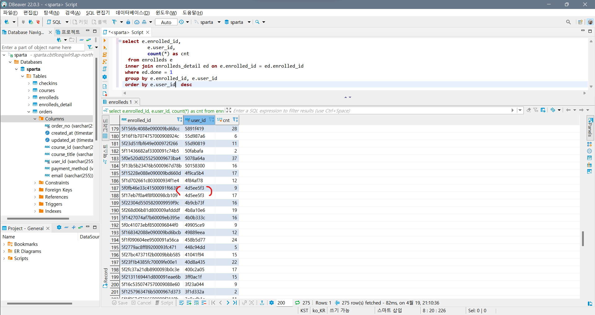

## JOIN

### JOIN

```sql
유저 테이블에 포인트가 있는 유저 테이블을 조인 
> select * from users u
> inner join point_users p
> on u.user_id = p.user_id;
```


> from → join → select

```
포인트가 많은 순으로 정렬
> select * from point_users p
> inner join users u 
> on p.user_id = u.user_id
> order by p.point desc;
```


```sql
> select u.name, count(u.name) as count_name from orders o
> inner join users u
> on o.user_id = u.user_id 
> where u.email like '%naver.com'
> group by u.name;
```
> from → join → where → group by → select


```sql
> select c1.title, c2.week, count(*) as cnt from courses c1
> inner join checkins c2 on c1.course_id = c2.course_id
> inner join orders o on c2.user_id = o.user_id
> where o.created_at >= '2020-08-01'
> group by c1.title, c2.week
> order by c1.title, c2.week
```


### UNION
```sql
(
	select '7월' as month, c.title, c2.week, count(*) as cnt from checkins c2
	inner join courses c on c2.course_id = c.course_id
	inner join orders o on o.user_id = c2.user_id
	where o.created_at < '2020-08-01'
	group by c2.course_id, c2.week
  order by c2.course_id, c2.week
)
union all
(
	select '8월' as month, c.title, c2.week, count(*) as cnt from checkins c2
	inner join courses c on c2.course_id = c.course_id
	inner join orders o on o.user_id = c2.user_id
	where o.created_at > '2020-08-01'
	group by c2.course_id, c2.week
  order by c2.course_id, c2.week
)
```


### 숙제
```sql
> select e.enrolled_id, e.user_id, count(*) as cnt
> from enrolleds e
> inner join enrolleds_detail ed on e.enrolled_id = ed.enrolled_id
> where ed.done = 1
> group by e.enrolled_id, e.user_id
> order by e.user_id  desc
```

