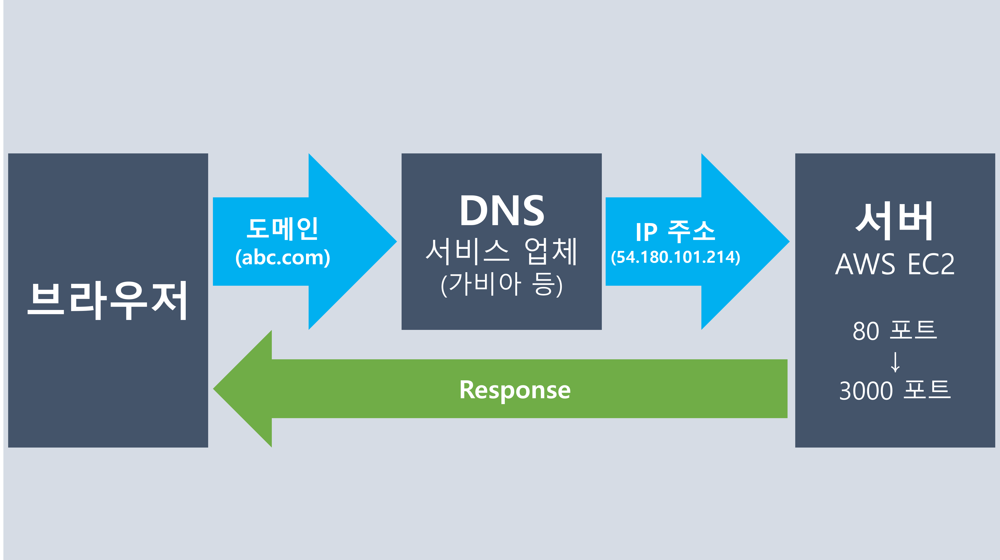

## 도메인 주소에서 서버까지
> 우리가 브라우저에서 구매한 도메인 주소를 입력하면    
> 만들어 놓은 aws EC2 서버까지 전달이 되어서    
> 해당 서버에게 요청을 보낼 수 있습니다.    
> 이 과정이 상세하게 어떻게 진행되는지 그림으로 한번 그려볼까요?

### 그림으로 이해하기

### 각각의 역할
> 도메인: 서버 IP 주소로 보내줄 도메인 주소를 설정   
> DNS: 도메인 주소를 IP 주소로 변환   
> 서버: HTTP 요청의 80번 포트를 원하는 포트(예시 3000번)로 받아서 응답
> 