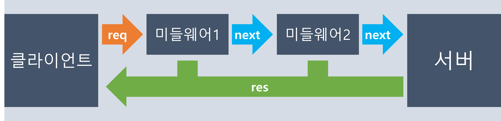

## 라우터는 미들웨어
> express.js의 라우터는 미들웨어입니다.    
> 어떤 원리로 동작하기 때문에 미들웨어로 라우터를 구현할 수 있나요?

### 미들웨어
> 클라이언트의 요청이 서버에 닿기 전까지 거쳐가는 관문   



> 거쳐"가야" 하기 때문에 next()를 호출함
```javascript
app.use((req, res, next) => {
  console.log('Time:', Date.now());
  next();
});
```

### 미들웨어의 유형
1. 애플리케이션 레벨 미들웨어
2. 라우터 레벨 미들웨어
3. 오류 처리 미들웨어
4. 기본 제공 미들웨어
5. 서드파티 미들웨어

### 애플리케이션 레벨 미들웨어
app.use()를 통한 미들웨어
```javascript
app.use('/user/:id', (req, res, next) => {
  console.log('Request URL:', req.originalUrl);
  next();
}, (req, res, next) => {
  console.log('Request Type:', req.method);
  next();
});
```

### 라우터 레벨 미들웨어
router.use()를 통한 미들웨어
```javascript
const router = express.Router();

router.use('/user/:id', (req, res, next) => {
  console.log('Request URL:', req.originalUrl);
  next();
});

router.get('/user/:id', (req, res) => {
  return res.render('regular');
});
```

### 오류 처리 미들웨어
```javascript
app.use((err, req, res, next) => {
  console.error(err.stack);
  return res.status(500).send('Something broke!');
});
```

### 라우터 = 미들웨어?
애플리케이션 레벨 미들웨어이며,   
라우터 레벨 미들웨어에서 구체적인 동작 제어
```javascript
// app.js
// movie.com/movie
const movieRouter = require("./routes")
app.use('/movie', movieRouter);
```
```javascript
// routes/movieRouter.js
const movieRouter = express.Router();

// => movie.com/movie/1/edit
movieRouter.get('/:id/edit', (req, res) => {
  return res.render("editPage");
});

// => movie.com/movie/1/edit
movieRouter.post('/:id/edit', (req, res) => {
  return res.redirect(`/movie/${id}`);
})
```